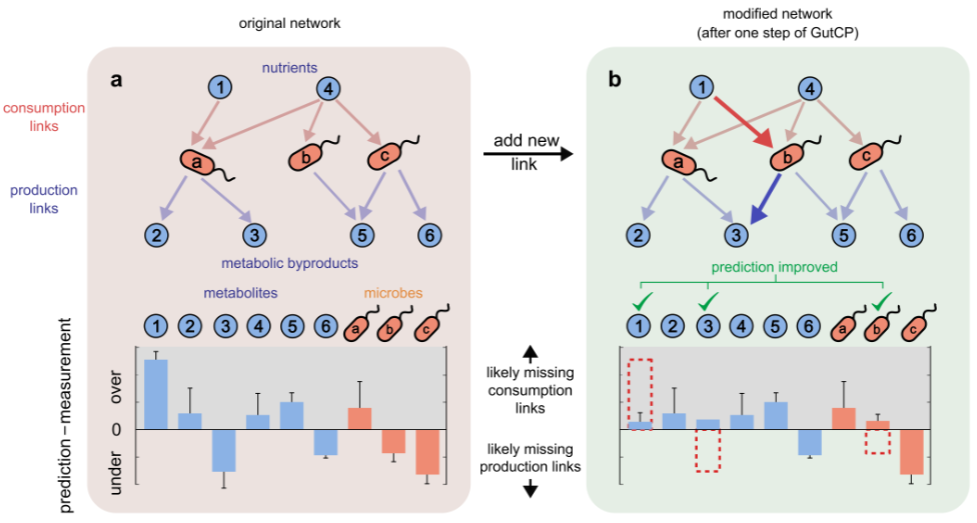

# Trophic-model-of-human-microbiome and GutCP (Gut Cross-feeding Predictor)
The trophic model is designed to predict the metabolome (metabolite levels) from the species relative abundance. It optimizes the nutrient intake of the gut to minimize the error between model predicted metagenome and the experimentally measured metagenome. The metabolome is generated automatically from the trophic model without fitting to it. More details about this model can be found [here](https://journals.plos.org/ploscompbiol/article?id=10.1371/journal.pcbi.1007524).

GutCP (Gut Cross-feeding Predictor) is an algorithm developed to predict the cross-feeding interactions in the human gut microbiome. GutCP combines machine learning techniques with an ecological model of the microbiome. Here, GutCP utilized the ecology-based trophic model to demonstrate the power of the algorithm.

## Brief introduction of the trophic model

The human gut microbiome is a complex ecosystem, in which hundreds of microbial species and metabolites coexist, in part due to an extensive network of cross-feeding interactions. Kinetic models for such ecosystems like the human gut microbiome are nearly impossible because several thousands of kinetic parameters are needed to build such kinetic models. Here, using a simplified model, we provide quantitative support for a multi-level trophic organization of the human gut microbiome, where microbes consume and secrete metabolites in multiple iterative steps. The model requires "a network of metabolic interaction for microbes" involving the metabolite consumption and production by microbes.

Besides the ability to provide support for a trophic organization of the human microbiome, the model has the ability to predict an individual's metabolome from its metagenomic data. In the model, the nutrient intake of the gut is optimized to minimize the error between the model predicted metagenome and the experimentally measured metagenome. The metabolome is generated automatically from the trophic model without fitting to it. When the predicted metabolome for each individual in one dataset is compared with its experimentally measured metabolome, the Pearson correlation between the two is statistically significant (Pearson correlation $0.67 \pm 0.2$; median P-value $8\times 10^{-4}$). The logarithmic error between the predicted metabolome and the experimentally measured metabolome is on average 0.8 (which is within 1 order of magnitude).

## Introduction of GutCP (Gut Cross-feeding Predictor)

 As shown in the schematic, the idea of GutCP is to use the experimentally measured metagenomic and metabolomic data to predict experimentally unrevealed metabolite-microbe consumption/production interactions. Using the trophic model, GutCP infers high-confidence yet experimentally untested metabolite-microbe consumption/production interactions constrained by the metagenomic and metabolomic data. A list of high-confidence interactions is given by running the simulation multiple times to discover the prevalent links.

## Data requirements
Three types of data are needed to run the trophic model and GutCP:
* The relative abundance of microbial species in different individuals: abundance_matched_thai.txt
* The metabolite levels in different individuals (also known as metabolome): metabolome_matched_thai_modified_by_Tong.xlsx
* The bipartite network made of exchange reactions of microbes towards metabolites (such as the consumption of glucose by E.coli or production of acetate by E. coli): pruned_chia_network.csv

## Getting started
### Data processing
In order to run the trophic model with steps of metabolite consumption, byproduct generation, and byproduct consumption, the labeling of microbes and metabolites and tIn order to run the trophic model with steps of metabolite consumption, byproduct generation, and byproduct consumption, the labeling of microbes and metabolites and the proper matching of the same microbe or metabolite between the above 3 types of data needs manual curation. The labeling of all nodes (microbes or metabolites) is shown in "names_ID.txt" and for this simulation, we stick to the labeling adopted in the [NJS16 database](https://www.nature.com/articles/ncomms15393). 

Also, the trophic model needs nutrient intake. Here, for simplicity, we avoid the consideration of complicated chemical degradation of complex large molecules (such as polysaccharides). Instead, we consider the small sugars degraded from the polysaccharides as the nutrient intake and all the simple sugar we included is in "nutrient_intake_ID.txt".he proper matching of the same microbe or metabolite between the above 3 types of data needs manual curation.

To speed up the simulation and avoid the loading of data all the time, all data are cleaned and prepared into well-defined data frames and later saved in the pickle file, ready to be utilized in the simulation of the trophic model and GutCP. For instance "Trophic_model_for_gut_data_processing.ipynb" is used to process the network data into the format required by the main code "Trophic_model_for_gut.ipynb"

### Trophic model
After running all the scripts in "Trophic_model_for_gut_data_processing.ipynb", we are ready to run the trophic model and compare the predicted metabolite levels with experimentally measured ones. To do so, simply open the file "Trophic_model.ipynb" and run all scripts.

### GutCP
"GutCP.ipynb" contains two parts. The first part is the repeat of the above trophic model to load all functions related to the trophic model. The second part is the GutCP algorithm which is the Markov Chain Monte Carlo algorithm of proposing random links (exchange reactions) to add and accepting according to the change in performance.

### GutCP with deletion of links
The above GutCP only add links. An interesting direction worth trying is to delete random links and see if the performance can be improved via the deletion of false-positive links. "GutCP_delete_links.ipynb" is the script utilized to explore the influence of deletion of links. It starts with the deletion of a random percentage of random links and sees how the performance of the trophic model is worsened by it. Then it runs the GutCP with the ability to delete links that might improve the model performance.